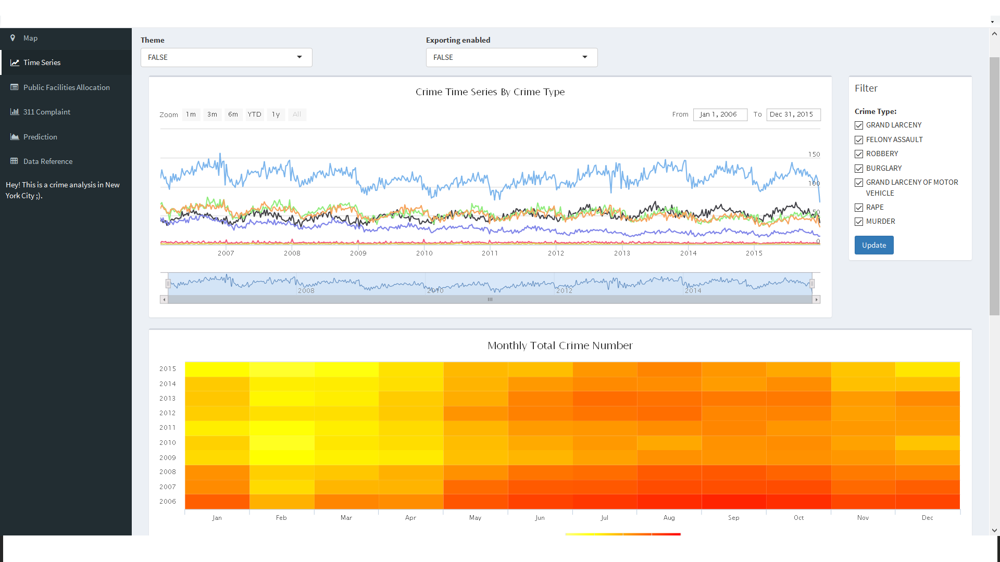
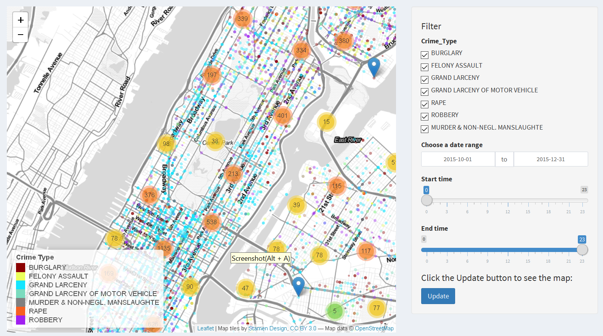

# Project: Open Data NYC - an RShiny app development project
### [Project Description](doc/project2_desc.md)

Term: Fall 2016

+ Team 6
+ Projec title: NYC Crime Analysis
+ App link: 
[Crime Analysis](https://minghao.shinyapps.io/crime_analysis/)
+ Team members
	+ Weichuan Wu
	+ Jiwen You
	+ Youzhu Liu
	+ Yueqi Zhang
	+ Minghao Dai
	
+ Project summary:
The goal of this dashboard is to provide knowledge of how to appropriately apply and interpret statistics and data visualization relevant to crime analysis.
We divided the dashboard into 6 parts: interactive map, time series analysis, public facilities allocation analysis, 311 complaints, prediction and raw data reference.
We use dataset from NYC Opendata, United States Zip codes website to perform data visualization, statistical analysis and geographic mapping.
This dashboard combines data explanatory methods and shiny application, which will people a comprehensive understanding of New York City Crime Status.
.

In this second project of Applied Data Science, we will carry out *Exploratory Data Analysis and Visualization* via a shiny app on a topic about open data released from the [New York City open data portal](https://nycopendata.socrata.com/). See [Project 2 Description](doc/project2_desc.md) for more details.  





The **learning goals** for this project is 
- business intelligence for data science
- systems development/design life cycle
- shiny app/shiny server

**Contribution statement**: 
+ Jiwen You :
	+ Transformed the longitude and latitude into zipcode for the crime dataset
	+ Extracted raw data and create RData file for project use
	+ Completed the statistical analysis and R Shiny demonstration for the public facility allocation section
	+ Edited, consolidated and cleaned statements and scripts

+ Minghao Dai: 
         
	+ Extracted daily crime data set by crime type, saved as preddata.csv
	+ Ploted crime count time series plot by date and crime type
	+ Ploted all type crime number heat map by years and months
	+ Made prediction for each crime type time serie by fitting a TBATS model
	+ Completed the Time series part in our Shiny app

+ Weichuan Wu: 
         
	+ Processed the raw crime data for crime map and built the first version of ui.R and server.R by plot the crime map
	+ Collected the statistics data by zip code and use it to draw the crime against income plot
	+ Analyzed the crime data and draw the 30 days accumulated crime plot
	+ Analyzed the crime interval distribution and make the plot
	+ Ploted the scatterD3 map in Prediction section to analyze whether can use crime to predict murder or not
	+ Helped teammates to learn the Shiny and help them to debug.
	
+ Yueqi Zhang:

	+ Extracted 311 complaint data around the places of each type of crime seperately
	+ Calculated the number of various complaints for each type of crime 
	+ Ploted wordcloud of complaint types to see the rough frequence of each complaint within every crime.
	+ Compared the difference of complaints situation between the place of high-frequency crime and normal place by histogram.
	+ Builded R shiny files to show the result I get. 
	
+ Youzhu Liu: 

	+ Improved ui.R and server.R of the crime map by adding clustering options.
	+ Design and plot the frame of Shiny dashboard.
	+ Collected the statistics data by zip code.
	+ Built raw data set page for user reference and downloading.


Following [suggestions](http://nicercode.github.io/blog/2013-04-05-projects/) by [RICH FITZJOHN](http://nicercode.github.io/about/#Team) (@richfitz). This folder is orgarnized as follows.

```
proj/
├── lib/
├── data/
├── doc/
├── figs/
└── output/
```

Please see each subfolder for a README file.

